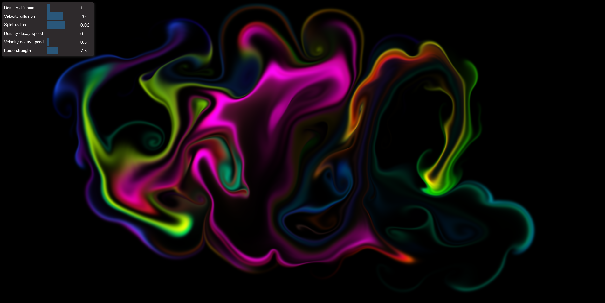

# Basic Fluid Simulation
Basic WebGL fluid simulation. Drag the mouse around to add matter and motion.

Used resources:
- PavelDoGreat's [fluid simulation](https://github.com/PavelDoGreat/WebGL-Fluid-Simulation)
- Inspecto's [video](https://www.youtube.com/watch?v=qsYE1wMEMPA) about fluid simulations.
- [Real-Time Fluid Dynamics for Games](https://damassets.autodesk.net/content/dam/autodesk/www/autodesk-reasearch/Publications/pdf/realtime-fluid-dynamics-for.pdf)
